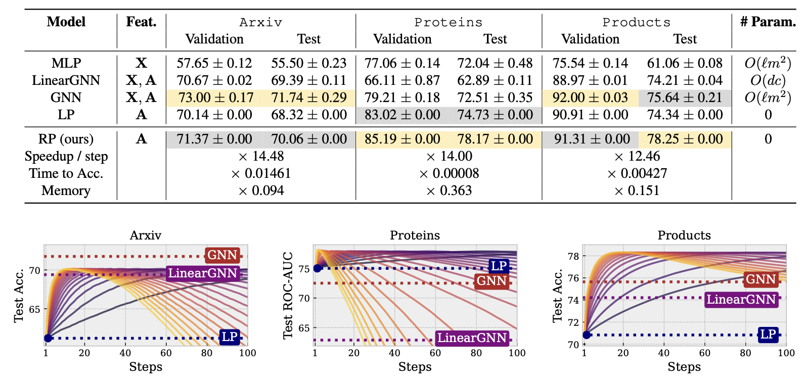
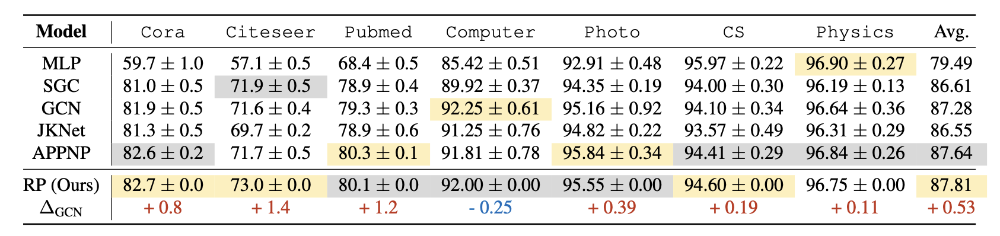
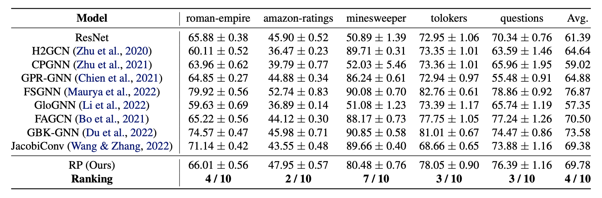
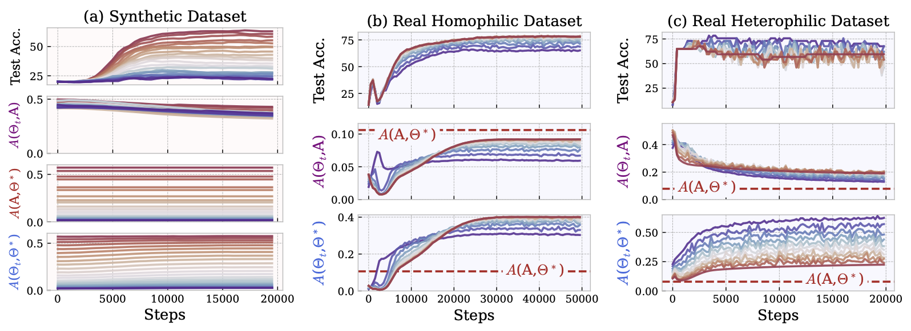

# How Graph Neural Networks Learn: Lessons from Training Dynamics

This is the official implementation of Residual Propagation (RP) proposed in ["How Graph Neural Networks Learn: Lessons from Training Dynamics"](https://arxiv.org/pdf/2310.05105), which is accepted to ICML 2024.

## Implementation of RP
The implementation consists of two main folders:

1. **`RP/`**: This folder contains the code for the basic version of the RP algorithm, which uses only the graph structure. Refer to Algorithm 1 in the paper for more details.

2. **`Generalized_RP/`**: This folder contains the code for the generalized RP algorithm that uses kernel functions to incorporate node features. Refer to Algorithm 2 in the paper for more details.

The core part of the RP implementation is very simple and can be summarized as follows:

```python
# Initialize residuals as [Y,0]
redisuals = torch.zeros_like(data.onehot_y)
redisuals[train] = data.onehot_y[train].clone()

for step in range(1, args.steps + 1):
    # Create masked residuals [R,0]
    masked_residuals = redisuals.clone()
    masked_residuals[test] =  0

    # Update residuals [R,R'] = [R,R'] - \eta LP([R,0])
    redisuals -= step_size * LabelPropagation(masked_residuals)

predictions = - redisuals[test]
```

Note that the efficiency of the label propagation algorithm is not optimized in our code. One could consider using existing implementations in [DGL](https://docs.dgl.ai/en/0.8.x/generated/dgl.nn.pytorch.utils.LabelPropagation.html) or [PyG](https://pytorch-geometric.readthedocs.io/en/latest/generated/torch_geometric.nn.models.LabelPropagation.html) for better efficiency. Results are as follows:





## Visualization

The folder contains the code for visualizing the evolution of GNNs' NTK matrices during training. To reproduce the results, first run the bash script `run.sh`, then use the notebook `visualization.ipynb`.

